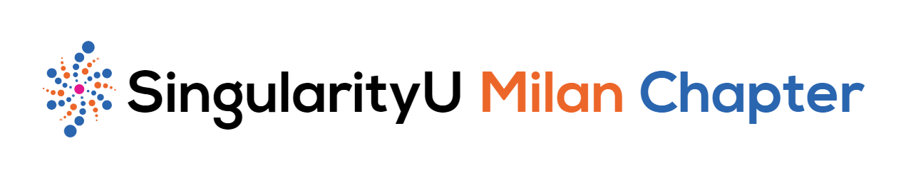

# SingularityU Milan Chapter web app

This is the source code for the web app created by the [SingularityU Milan Chapter](https://www.singularityumilan.com/) to improve the way people attend our events.
It is designed to help people find information and study materials more easily, without losing focus on the current event.
It is also a collection of past SU Milan Chapter events with related study materials.

**Live working version: [app.singularityumilan.com](https://app.singularityumilan.com)** (english, italian)

## Tech
- [Ionic](https://ionicframework.com)+[React](https://reactjs.org/) used for **UI/UX**
- [Supabase](https://supabase.io) used as **database** and **authentication** backend
- [OneSignal](https://onesignal.com) used for **Push Notifications**

## Installation
### Requirements
- `Node.js` and `npm`
- Ionic CLI ([instructions](https://ionicframework.com/docs/intro/cli#install-the-ionic-cli))
- Supabase API Keys ([how to obtain](https://supabase.io/docs/guides/with-react))
- Onesignal API Keys ([how to obtain](https://documentation.onesignal.com/docs/web-push-custom-code-setup))
- IBM Cloud Function API Key [details](cloud-functions/README.md)

### Install
- clone this repo: `git clone https://github.com/Luca8991/su-milan.git`
- navigate inside the created folder: `cd su-milan`
- create a file called `.env.local` and put these lines inside:
```
REACT_APP_SUPABASE_URL="<obtained in the requirements>"
REACT_APP_SUPABASE_PUBLIC_KEY="<obtained in the requirements>"
REACT_APP_ONESIGNAL_DEVELOPMENT_KEY="<obtained in the requirements>"
REACT_APP_ONESIGNAL_PRODUCTION_KEY="<obtained in the requirements>"
REACT_APP_ONESIGNAL_SAFARI_WEB_ID="<obtained in the requirements>"
REACT_APP_IBM_EVENTBRITE_WRAPPER_KEY="<obtained in the requirements>"
```
- install dependencies: `npm install`

### Run
- `ionic serve`

## License
Distributed under the MIT License. See [LICENSE](LICENSE) for more information.

## Authors
- **Roberto Crosignani** - _idea and marketing_ - [Website](https://www.robertocrosignani.com/)
- **Luca Bertelli** - _development_ - [GitHub](https://github.com/Luca8991/)

## Contributing
Contributions are always welcome! Feel free to open an **issue** and/or a **PR**.

## Contact Us
Reach us out at info@singularityumilan.com.
