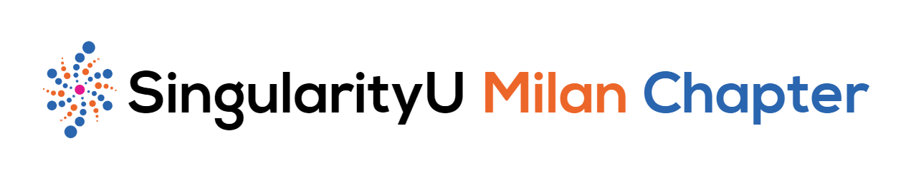

# SingularityU Milan Chapter web app

This is the source code for the web app created by the [SingularityU Milan Chapter](https://www.singularityumilan.com/) to improve the way people attend our events.
It is designed to help people find information and study materials more easily, without losing focus on the current event.
It is also a collection of past SU Milan Chapter events with related study materials.

**Live working version: [app.singularityumilan.com](https://app.singularityumilan.com)** (english, italian)

## Tech
- [Ionic](https://ionicframework.com)+[React](https://reactjs.org/) used for **UI/UX**
- [Supabase](https://supabase.io) used as **database** and **authentication** backend
- [Nx](https://nx.dev) used to manage the **monorepo**
- [Hardhat](https://hardhat.org) used to develop, test, compile and deploy **smart contracts**
- [Ethereum](https://ethereum.org) as the blockchain for **smart contracts**
- [OneSignal](https://onesignal.com) used for **Push Notifications**
- [IBM Cloud Functions](https://www.ibm.com/cloud/functions)+[Eventbrite API](https://www.eventbrite.com/platform/api) used to check if a user has bought a ticket from **Eventbrite**
- [Amazon API Gateway](https://aws.amazon.com/api-gateway/)+[AWS Lambda](https://aws.amazon.com/lambda/) used to **mint NFT certificates** (see [Axelera/SUMilanCertificates](https://github.com/Axelera/SUMilanCertificates) for details)

## Install, Run & Deploy
### Requirements
- `Node.js` and `npm`
- Supabase API Keys ([how to obtain](https://supabase.io/docs/guides/with-react))
- Onesignal API Keys ([how to obtain](https://documentation.onesignal.com/docs/web-push-custom-code-setup))
- IBM Cloud Function API Key ([details](cloud-functions/README.md))
- Amazon API Gateway API Key (see [here](https://github.com/Axelera/SUMilanCertificates/blob/master/api/lambda/README.md) for details)

### Install
- clone this repo: `git clone https://github.com/Axelera/SUMilanApp.git`
- navigate inside the created folder: `cd SUMilanApp`
- create a file called `.env` and put these lines inside:
```
NX_SUPABASE_URL="<obtained in the requirements>"
NX_SUPABASE_PUBLIC_KEY="<obtained in the requirements>"
NX_ONESIGNAL_DEVELOPMENT_KEY="<obtained in the requirements>"
NX_ONESIGNAL_PRODUCTION_KEY="<obtained in the requirements>"
NX_ONESIGNAL_SAFARI_WEB_ID="<obtained in the requirements>"
NX_IBM_EVENTBRITE_WRAPPER_KEY="<obtained in the requirements>"
NX_AWS_LAMBDA_CERTIFICATE_API_KEY="<obtained in the requirements>"
```
- install dependencies: `npm install`

### Run
To run the development server, run this command:
- `npx nx run sumilan-app:serve`

### Build & Deploy
To compile web assets and prepare them for deployment, run this command
- `npx nx run sumilan-app:build:production`

This will generate a folder containing all the web assets ready to be deployed on your hosting at `dist/apps/sumilan-app`.

## License
Distributed under the MIT License. See [LICENSE](LICENSE) for more information.

## Authors
- **Roberto Crosignani** - _idea and marketing_ - [Website](https://www.robertocrosignani.com/)
- **Luca Bertelli** - _development_ - [GitHub](https://github.com/Luca8991/)

## Contributing
Contributions are always welcome! Feel free to open an **issue** and/or a **PR**.

## Contact Us
Reach us out at [info@singularityumilan.com](mailto:info@singularityumilan.com).